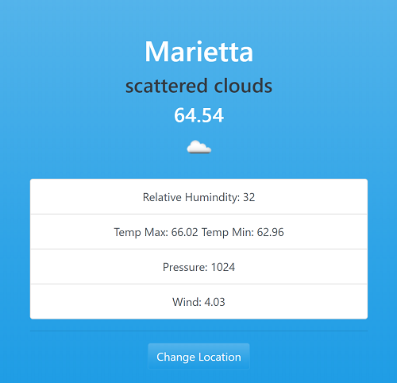

# Weather App

This application uses https://wwww.openweathermap.org API to fetch current weather conditions based on provided zipcode. It defaults to a zip code in GA (USA) and later user can change zip code. This change persists as zip code data is stored in browser's location storage.

### Language/Technology used

This application uses

- Javascript (Fetch API, Async/Await functions, JSON)
- Bootswatch CSS (based on Bootstrap 4.0)

### How to use

Download this repos content either in zip format or clone it. Open folder's content using VScode ( or choice of your editor), run live server built into VScode on index.html.

_I would like to thank Brad @ http://www.traversymedia.com_ as this effort is part of my learning from his contents

